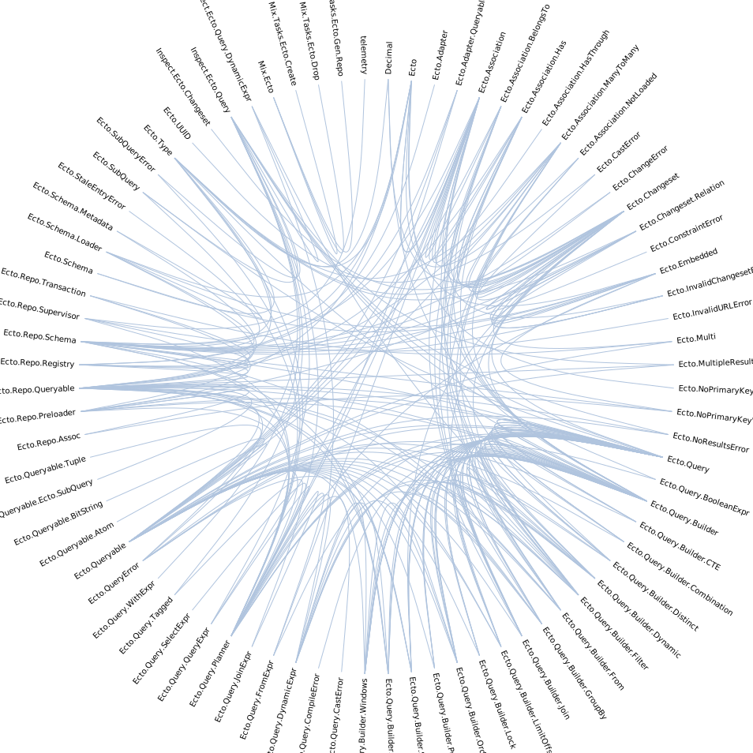

# Graf

Visualizes Elixir project codebase as a [Hierarchichal Edge Bundling](https://www.data-to-viz.com/graph/edge_bundling.html) graph.

Utilizes Mike Bostock's [example](https://observablehq.com/@d3/hierarchical-edge-bundling) implemented in D3.

## Quick start

```bash
git clone https://github.com/elixir-ecto/ecto.git /tmp/ecto

docker run --rm -v /tmp/ecto:/project \
    -e MAX_DEPS_DEPTH=1 \
    -e BUILTIN=false \
    -e SHORTEN_MODULE_NAMES=false \
    -e COLOR=lightsteelblue \
    studzien/graf:latest /project \
    > ecto.svg
```

After it finishes, `ecto.svg` should look similar to this:



## Running

`./priv/generate.sh` is an entrypoint to the script.
It takes Elixir projects directories as arguments and outputs a SVG with
Hierarchichal Edge Bundling graph representing structure of these projects.

Generation has two phases:

  1. An Elixir script (`priv/graf.exs`) first generates JSON with
  relationships between modules from provided projects and for given options;
  1. A Node.js script (`priv/heb/index.js`) then generates a SVG from the JSON.

You can run this script locally, and not in the Docker container, but make sure you
have Node available and run `make setup` first, that will install all JS dependencies.

## Configuration

All configuration of the generation script is currently done
via environmental variables.

The available variables are:

- `MAX_DEPS_DEPTH` (default: 0) - how deep the generator should look into the dependencies when generating graph?
- `BUILTIN` (default: false) - should built-in modules (like `Enum` or `erlang`) be considered when generating the graph?
- `SHORTEN_MODULE_NAMES` (default: true) - should the module name on the graph be shortened to the last part? (i.e. `Graph` instead of `Graf.Graph`)
- `COLOR` (default: #ccc) - the color of edges on the graph

## Troubleshooting

If a graph can't be generated for your project or seems to be incorrect please create an issue describing the problem.
